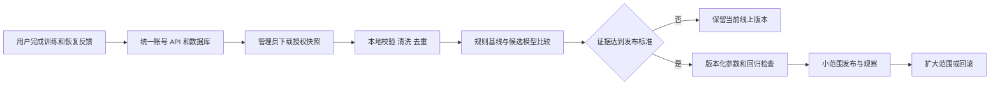

# 三项训练：域名部署、百人规模与双周算法迭代方案

核查日期：2026-09-21。范围：网页首发保留账号、跨设备同步、留言板；不足 100 名用户；管理员下载数据在本地分析；随后发布微信小程序、Android、iOS。用户已选择自行填写阿里云 DNS，本轮交付真实解析记录与实施方案。

## 1. 推荐决策

1. 先保留现有 JavaScript 网页、微信原生页面和共用训练模块。网页上线不以重写 Flutter 为前提。若必须将四端界面合并为一套，再选择 uni-app 做有边界的迁移验证。
2. 免费静态托管可以承担前端；账号与训练回传需要运行接口和持久数据库。首选免费大陆前端 + 一个小型 Node.js / SQLite 后端。只部署一份后端和一份主数据库，不设计分布式系统。
3. 现有 Sites 站点已申请绑定 `big3.hectorgao.com`，先按第 2 节完成这一绑定。它与后续大陆主站选型是两个发布步骤；绑定这个地址不会把 Sites 变成大陆节点，也不会把本地后端自动发布到云端。
4. 初期使用现有规则和小模型进行个体校准。每两周形成数据快照、质量报告、候选模型和对比结果；只有满足已冻结的发布标准才替换线上参数。

## 2. 阿里云 DNS：可以直接填写的真实记录

Sites 管理接口返回的现有站点：

- 站点：[三项训练](https://three-lift-training.hectorggg.chatgpt.site)。接口显示公开、存在一个已发布版本。
- 已登记自定义域名：`big3.hectorgao.com`。
- 当前域名状态：`pending`；证书状态：`pending_validation`。本次刷新后仍未验证成功。
- 公共 DNS 显示 `hectorgao.com` 的权威服务器为 `dns9.hichina.com`、`dns10.hichina.com`，已经使用阿里云 DNS，无需改 NS。
- 公共 DNS 尚未查到以下目标 CNAME 和两条 TXT；目前 `big3` 有 A / AAAA 应答，可能来自同名记录，也可能来自 `*` 泛解析。没有登录控制台，不能判定是哪一种。
- 本机直接读取现有站点的发布清单与账号接口得到 HTTP 403。此结果不证明页面不可用，也不构成完整线上可用性验收；目前不能确认该发布版本有在线账号服务。

进入 **阿里云控制台 → 云解析 DNS → 公网权威解析 → hectorgao.com → 解析设置**。主机记录只填写下表中的相对名称，解析请求来源选择“默认”，TTL 选择 10 分钟或控制台允许的默认值。

| 类型 | 主机记录 | 记录值 |
|---|---|---|
| CNAME | `big3` | `custom-domains.chatgpt.site.` |
| TXT | `_openai-site-verification.big3` | `openai-site-verification=dEFA2zqW1OIHD-iBOrA3cPC_LXj-JBWnRnBOb8-jfB4` |
| TXT | `_cf-custom-hostname.big3` | `118eb569-4e8b-4d5a-9ad3-5855814d58fe` |

TXT 值无需手动加引号。CNAME 值只填域名，不加 `https://` 或路径。以上验证值是本次现有站点接口的实际返回值，不是示例，也不是登录凭证。

处理已有记录时：

- 若控制台确有主机记录为 `big3` 的 A / AAAA，先记录旧值并确认旧服务用途；同名同线路的 A / AAAA 不能与 CNAME 并存，需要将这个子域名切换为上述 CNAME。
- 若只有 `*` 的 A / AAAA，保留泛解析，为 `big3` 增加更具体的 CNAME 即可。
- 保留根域名 `@`、`www`、邮箱 MX/TXT 和其他子域名的原有设置。
- 证书与域名验证均通过后，用 `https://big3.hectorgao.com` 验证页面、资源和后端功能。DNS 正确、证书有效、账号可用是三项分别检查的结果。

可用以下只读命令检查传播：

```sh
dig @223.5.5.5 big3.hectorgao.com CNAME +short
dig @223.5.5.5 _openai-site-verification.big3.hectorgao.com TXT +short
dig @223.5.5.5 _cf-custom-hostname.big3.hectorgao.com TXT +short
```

应分别得到上表的目标值。若本机 DNS 被代理接管，用公共 DNS 查询页面和阿里云控制台核对，不把代理返回的虚拟 IP 当成真实解析结果。之后刷新托管平台的域名状态，等待 HTTPS 证书激活；不要通过关闭证书校验来验收。

阿里云操作依据：[添加解析记录](https://help.aliyun.com/zh/dns/pubz-add-parsing-record)、[解析记录冲突规则](https://help.aliyun.com/zh/dns/pubz-faq-related-to-domain-name-resolution-resolution-records/)。

### 备案目前仍未知

在 [工信部备案查询](https://beian.miit.gov.cn/) 选择 ICP 备案查询，输入 `hectorgao.com`，核对主办单位、域名和备案号。域名已购买、实名认证或使用阿里云 DNS，都不等于完成 ICP 备案。如果显示别人的主体，也不能直接作为自己的部署依据。官方步骤见 [阿里云备案查询说明](https://help.aliyun.com/zh/icp-filing/basic-icp-service/support/how-to-query-the-registration-information)。

EdgeOne 选择中国大陆或全球含大陆可用区时，自定义域名必须已有备案；全球不含大陆可用区不要求这项备案，但不能据此保证大陆访问质量。[EdgeOne 域名规则](https://pages.edgeone.ai/zh/document/custom-domain)

## 3. 不足 100 人，实际需要多少存储

### 测算方法与结果

只调用 `server/demo.js` 的 `demoData()` 在内存中生成数据，未运行种子写库、未读取真实用户档案。该样本是结构测算用的人工数据，不能加入研究训练集。

- 39 次训练，312 个组，完整档案 JSON 为 148,259 字节。
- 平均一次训练约 3,668 字节，另有约 102 字节的当日反馈。
- 假设 100 人、每人每周 4 次、一年 52 周，不上传照片和视频。

| 每次训练组数 | 100 人一年原始训练与反馈 JSON 估算 |
|---|---:|
| 8 组，接近现有模拟档案 | 约 79 MB |
| 20 组，按现有组记录字段外推 | 约 188 MB |
| 30 组，按现有组记录字段外推 | 约 279 MB |

这些是字段体积估算，未包含数据库索引、审计、草稿、版本历史、留言、备份和以后新增字段。初期为业务数据库预留 0.5–1 GB 较合理，备份另算；不能把“100 人”直接等同于固定存储量。训练图片作为共用静态资源只保存一份；用户视频另行设计存储、配额和费用。

### 当前更大的问题是同步方式

`preview/sync.js` 每 20 秒在可见页面拉取整个 `/api/state`；修改后也上传整个用户档案。以一年后约 0.785 MB/人的较小档案计算，若 100 人每天各开页面一小时，仅轮询就是 18,000 请求/日、约 14 GB/日的未压缩响应。留言轮询、写入、认证还会额外增加请求。该数字是给定使用假设下的估算，不是实测流量。

按成本递增顺序修改：

1. 先支持版本查询或 ETag / 304，版本不变只返回很小的响应；后端也先查版本，避免每次把大 JSON 读出再丢弃。保持退出页面停止轮询、失败退避、立即同步入口。
2. 写入仍保留现有版本冲突检测，不以“人数少”为由让旧设备覆盖新设备。暂时无需 Redis、消息队列或实时 WebSocket。
3. 如果选 D1 / KV 或档案明显增长，将已结束训练按 session 保存，每次只上传发生变化的训练；档案、反馈、草稿分别按稳定 ID 保存。为离线重试保留幂等键，处理补录、修改和删除标记。

当前单用户档案上限为 5 MB。D1 单行上限为 2 MB；EdgeOne KV 单值为 1 MB。把每个人所有年份的数据塞在一个值中，会先触及单行或单值限制，不能只看平台总容量。[D1 限制](https://developers.cloudflare.com/d1/platform/limits/)、[Makers 配额](https://pages.edgeone.ai/zh/document/limits-and-quotas)

## 4. 免费托管能否满足首发

| 方案 | 当前免费条件或额度 | 对本项目的判断 |
|---|---|---|
| EdgeOne Makers 静态前端 | 当前免费版：每月 500 次构建，静态项目总存储 5 GB；另有函数和 KV / Blob 免费额度，商业化后可能调整 | 大陆前端优先候选。选择含大陆区域需备案；静态前端并不自带本项目数据库 |
| 阿里云 ESA Pages | ESA 有免费套餐，适合个人测试且无 SLA；边缘函数当前每日 10 万免费请求。站点套餐与函数计费需一起核对 | 可做大陆前端候选。免费额度、区域资格、续期条件以账户控制台为准；阿里云 DNS 与 ESA 是两个产品 |
| Cloudflare Pages / Workers + D1 | Workers 每日 10 万动态请求、每次 10 ms CPU；D1 免费单库 500 MB、账户总量 5 GB、每日读 500 万行/写 10 万行 | 容量可支撑百人试点，但不是上传现有 Node 后端就能运行。免费方案不含 Cloudflare 大陆网络，必须实测用户网络 |
| 腾讯 CloudBase 免费体验环境 | 当前 3,000 资源点/月，单次可续期 6 个月，有资格和功能限制；官方还有续期任务说明 | 可做验证环境，不能直接承诺完整正式产品长期零费用；当前文档对小程序发布后的免费期限另有限制 |
| 当前 Sites 站点 | 已有已发布版本和待验证域名 | 先完成现有域名交付；本次未取得可承诺的免费容量、大陆直连与后端持久化保障，不将它等同于正式大陆数据服务 |

来源：[Makers 配额](https://pages.edgeone.ai/zh/document/limits-and-quotas)、[ESA 免费套餐](https://help.aliyun.com/zh/edge-security-acceleration/esa/product-overview/free-plan)、[ESA 函数计费](https://help.aliyun.com/zh/edge-security-acceleration/esa/user-guide/functions-and-pages-billing)、[Workers 限制](https://developers.cloudflare.com/workers/platform/limits/)、[D1 价格](https://developers.cloudflare.com/d1/platform/pricing/)、[Cloudflare 大陆网络须单独购买企业服务](https://developers.cloudflare.com/china-network/)、[CloudBase 现行价格说明](https://cloud.tencent.com/document/product/876/75213)、[CloudBase 续期说明](https://cloudbase.cloud.tencent.com/blog/2026/07/28/cloudbase-free-trial-renewal)。

### 实施优先级

**最少改动的正式路线：** EdgeOne 免费前端 + 国内一个 Node.js 进程 + 一个持久 SQLite 数据库 + 每日备份。根据备案结果选择服务器地域和接入流程。服务器具体价格在选实例时确认，本方案不生成订单。百人低并发不需要改 PostgreSQL、分库或容器集群。

**尽量零费用的试点路线：** 前端免费托管，API 改为 Worker / 函数，数据库用免费托管数据库。前端在大陆可访问，还需要 API 在大陆可访问；两者都通过实际网络验收才可采纳。不要把海外免费 API 接在大陆前端后就宣布“大陆已可用”。

Cloudflare D1 支持 SQLite SQL 语义，但不是磁盘上的 `big3.sqlite`。当前 `node:sqlite`、本地文件、事务和会话逻辑需要适配其数据库绑定；本地文件或函数临时目录不能充当持久数据库。现有密码使用 scrypt，迁移时要在目标运行时测量耗时、CPU 和内存。不能为通过免费 10 ms 限额而降低密码保护强度。[Workers Node 兼容说明](https://developers.cloudflare.com/workers/runtime-apis/nodejs/)、[Crypto 支持](https://developers.cloudflare.com/workers/runtime-apis/nodejs/crypto/)

EdgeOne 的 KV / Blob 配额足够存一部分数据，但不能未经验证就代替账号数据库：唯一用户名、会话撤销、版本条件写入需要正确的一致性和原子性。当前方案不额外重写一套存储系统来“省一台小服务器”。

### 网页与接口如何连接

- 前端主地址最终沿用 `big3.hectorgao.com`；海外备用前端可用 `big3-global.hectorgao.com`；统一 API 拟用 `api.hectorgao.com`。后两者目前是规划，尚无可填写的托管目标，不能照抄 Sites 的 CNAME。
- 当前网页请求写死 `/api/`，Cookie 使用 `credentials: same-origin`，后端只允许一个 Origin。拆分部署时必须设置 API 地址、精确的允许来源、预检和携带凭证请求。`big3`、`big3-global`、`api` 都使用 HTTPS 同站点子域名有利于 Cookie 方案；`chatgpt.site` 等异站点地址不能直接照搬同一登录假设。
- 如果托管平台实际支持并验证了同域 `/api` 代理，可保留同域请求；否则用明确的跨域 API。不能把静态路径重写功能误认为可反向代理任意后端。
- 用户档案和管理员导出永远不放入 `dist`、公开 Git、静态对象目录或模型发布包。
- 现有管理员初始化只判断是否已有管理员。正式入口开放前应先在受控环境创建管理员并关闭公众初始化入口；演示账号和人工记录不进入正式数据库。

## 5. Flutter 是否能让四端保持一致

| 路线 | 网页 | 微信小程序 | Android / iOS | 对当前项目的代价 |
|---|---|---|---|---|
| Flutter / Dart | 官方支持 | 不在官方支持平台清单中，需额外运行时或独立实现 | 官方支持 | 大量 JS 逻辑和 UI 重写，仍要处理小程序差异 |
| uni-app / Vue + JS 或 TS | 支持 | 支持 | 支持 | 更贴合指定四端，但 DOM 页面与 WXML 都不能无改动编译，需迁移组件与平台 API |
| 现有网页 + 原生小程序 + 后续 Capacitor | 复用现有网页 | 复用现有原生页面 | 用网页构建包加原生能力 | 当前改动最少；保留两套页面，训练规则继续共享 |

官方依据：[Flutter 平台支持](https://docs.flutter.dev/reference/supported-platforms)、[uni-app 平台说明](https://uniapp.dcloud.net.cn/)、[Capacitor 接入已有网页](https://capacitorjs.com/docs/getting-started)。

Flutter 是框架，Dart 是语言；没有一门语言让商店规则、微信授权、文件保存、通知、后台计时、登录和硬件接口全部自动一致。微信 `web-view` 也不等于原生小程序转换。

本项目建议：首版沿用现有结构；若后续两套页面维护成本实际升高，先用 uni-app 迁移“登录 → 今日训练 → 完成记录 → 跨端同步”这一条流程，同时验证 H5、微信真机、Android、iOS，再决定是否全量迁移。若未来微信端不再重要，而原生交互与设备能力成为主要需求，再重新评估 Flutter。

保持算法一致更直接的方法是共用规则模块、动作 ID、单位约定、输入输出 schema 和版本化参数；同一组输入在各端得到一致结果。训练算法不因换界面框架而更科学。

## 6. 所有用户回传、管理员下载：现状与补齐项

### 现有能力已经覆盖的部分

`server/api.js` 提供账号、角色、按用户保存档案、版本冲突、管理员用户列表和单用户档案查看。`preview/account-ui.js` 的“用户管理 → 导出授权研究数据”可下载 JSON。研究导出会排除未同意的用户、模拟账号和标记为人工的历史。

因此数据应“同步到服务器，由管理员按权限读取”，不应复制到管理员自己的训练历史中，也不应把所有人合成一个训练账户。

业务同步与算法研究分开：已明确告知管理用途的用户记录可供管理员管理；用于模型训练仍遵守已有可选研究授权。若希望全体参与研究，应让全体分别同意，不能默认替他们勾选。撤回后下一次导出与训练排除其记录，管理员本地旧快照及模型关联数据按事先公布的保留与删除流程处理。

### 研究导出 v2 应保留的最小内容

| 类别 | 必要字段与理由 |
|---|---|
| 快照 | schema、snapshotId、UTC 导出时间、数据截止时间、源版本、内容哈希、导出人审计；重复导入不重复加样本 |
| 参与者 | 稳定研究 ID、授权版本和状态；账号映射另存，不导出用户名、密码、会话、留言正文 |
| 档案历史 | 当时的训练经验、目标、体重、器材可用性及变更时间；不能用今天的档案回填过去 |
| 计划 | 计划 ID、生成时间、训练类型、规则与模型版本、动作和顺序、目标重量/次数/组数/RIR/休息、推荐原因 |
| 实际组 | sessionId / setId、训练发生时间与记录时间、完成/跳过、实际重量次数、RIR、质量与成功状态、单位、单侧口径、器械 ID、热身/试重标记 |
| 恢复反馈 | 训练前疲劳/疼痛/分部位酸痛、训练后 session RPE、次日与 48 小时反馈；保留测量时间、缺失和值的版本 |
| 执行差异 | 用户改了什么、为何跳过或替换、是否补录、是否教练干预；避免把自主修改当作算法原处方效果 |

现有 v1 导出丢失了目标处方、完成状态、器械身份、反馈、稳定训练 ID 和算法版本等。即使原始档案含有部分字段，也必须在导出中保留。历史未记录的字段保持缺失，不从规则或当前页面反推成“事实”。

保留失败、跳过和不适反馈，不能只导出成功训练来训练模型；热身和试重单独标记，不混入工作组成绩。增量导入以用户/训练/组 ID 和源版本去重，旧记录修改及删除也要同步，不能只按训练日期取最近两周。

### 管理员本地使用流程

1. 初版在管理员页面主动下载当前有效授权者的研究快照；一次下载覆盖全部合格参与者。
2. 保存到 Git 目录之外的受限本地目录，原始快照只读并记录哈希。加密备份和恢复检查独立于模型训练。
3. 验证 schema、单位、重复 ID、时间、授权和人工数据标签；出具缺失率与排除数量，再生成 sessions / sets / feedback 三张分析表。
4. 导出权限只给管理员并记录审计；以后需要自动拉取时，使用可撤销、只读、仅研究导出的权限，而不是把管理员密码放到 CI。

离线记录保留在设备，联网后重试；管理员“已下载”不等于每个离线设备都已上传。每次报告写清同步截止时间、纳入用户数、训练数及缺失范围。

## 7. 如何科学优化每日训练，而非只换一个模型名称

### 先定义要改善的可测结果

- 短期：目标 RIR 与实际 RIR 的误差、计划完成率、因过量而减少训练的比例、次日主观疲劳和酸痛。
- 中期：同动作、同器械和相同计量下 4–8 周的可比较表现变化。e1RM 是有条件的估计，不能当成实测 1RM；无可靠测量时不宣称测得肌肥大或生理恢复率。
- 体验：训练时长、动作偏好、按计划训练的持续性。
- 约束：疼痛和不适优先；缺少足够信息时保持或减量，不生成看似精确的增重。

目标之间可能冲突。例如增大 RPE 并不必然代表效果更好，完成率高也可能只是训练太容易。不要只优化总吨位、在线时长或“越累越好”。

ACSM 2026 总结了 137 篇系统综述、超过 3 万参与者，支持渐进抗阻训练及目标相关的负荷和训练量安排。这类群体证据可以约束规则，不会直接验证某个人明天应做的精确重量、组数或休息时间。[ACSM 2026 正式立场文件](https://pubmed.ncbi.nlm.nih.gov/41843416/)

### 保留三层决策

1. **固定边界与规则：** 疼痛限制、动作适用性、器械身份、负荷口径、实际档位、未知重量待试重、开始后冻结计划、历史不改写。这些不交给模型自由学习绕过。
2. **个体状态估计：** 同动作可用负荷区间、余力偏差、训练表现趋势、主观恢复需要多久。先用同一用户可靠记录；新用户使用保守规则，逐步校准。
3. **候选方案排序：** 在边界内，对可执行的动作、重量、组数和次数组合排序，显示依据与不确定性。没有足够证据时返回规则方案。

不同机器的“50 kg”、单只哑铃重量、杠铃总重量、助力重量、自重难度、保持秒数都不是同一个量。总体模型可共享统计规律，但实际负荷仍以同动作、同器械、兼容口径的个人记录为锚点，不用卧推 PB 换算腿举或侧平举重量。

### 各训练日如何优化

| 类型 | 可学习或校准的部分 | 必须保留的边界 |
|---|---|---|
| 容量日 | 在目标 RIR 下可完成的组数、次数与单次负荷；周内工作量分配 | 总量变化受限，失败/疼痛不靠增加刺激解决 |
| 强度日 | 同动作较低次数下的可行负荷、组数与休息需求 | 不因预测高分强制冲 PB；未知负荷仍试重 |
| 技术日 | 可稳定完成的轻负荷与动作练习量 | 技术质量是独立结果，不能只追求吨位 |
| 恢复日 | 是否休息、低负担活动偏好、反馈再采集时间 | 不显示没有验证的“恢复百分比”，疼痛处理不靠模型诊断 |
| 减量日 | 根据连续表现下降与反馈调整减少的量和持续时间 | 有明确原因；不能让漏报反馈自动恢复高强度 |
| 评估 / PB 日 | 提示满足资格后的测试窗口 | 由已有资格、保护条件与主动选择控制，模型不自动触发极限尝试 |

上表是工程设计，不是新的医学阈值。具体数值先沿用 `science.js`、`coach.js` 的已有产品规则，改变时记录理由、版本和验证结果。

### 不足 100 人时选什么模型

推荐顺序：现有规则基线 → 个体校准/分层回归 → 正则化回归或小型树模型 → 有足够证据时再比较小型神经网络。分层模型让用户共享总体信息，同时保留个人偏差；避免为每个稀疏动作各训练一个大模型。

100 人一年每周 4 次约有 20,800 次训练，但同一人的组和天彼此相关，不能按几十万独立样本估计模型可信度。数据还会被动作、器械、目标和训练经验切成更小的子组。神经网络并非不能训练，而是目前没有证据说明其复杂度能换来更好的泛化。初期 CPU 即可，不需要租 GPU 或训练大语言模型。

已有随机交叉试验用强化学习安排运动，62 位实际参与者完成 559 次训练，观察到满意度和自报强度提高；其主要结果不是力量或肌肥大，不能据此宣称深度学习会让本项目的训练收益更高。论文还报告了低于预期的依从性与事后注册限制。[Doherty 等，2024](https://mhealth.jmir.org/2024/1/e49443)

训练记录是观察性数据：较强者可能本来就用更大重量，状态好时才选择高强度，疼痛者可能退出或不反馈。模型学到的相关性不等于“增加一组就能增加多少收益”。第一阶段只做状态预测和受约束的建议；要验证处方是否更优，需要预先定义的前瞻性比较，不能用算法自己生成的计划作为正确答案，也不在真实用户身上进行无约束强化学习探索。

### 必需的验证设计

- 分开回答“同一用户未来能否预测”与“新用户能否泛化”。前者按时间向前验证，后者按用户整体留出；不能随机打散同一个人的每组训练到训练集和测试集。
- 特征只使用生成建议时已经存在的记录。补录时间、未来反馈和当次训练的实际结果不能泄漏进预测输入。
- 预处理、缺失值处理、调参只在训练折拟合。相同快照同时评估当前线上模型和候选模型。
- 留出有明确结局窗口的未来记录；结果未成熟先等待。按用户汇总误差与置信区间，报告冷启动用户、不同动作/器械的覆盖和较差子组。
- 保留固定测试集并避免反复调参污染；数据足够时再设独立确认集。只提高离线拟合分数不足以替换实际处方。

分组与时间验证方法参见 [scikit-learn 交叉验证文档](https://scikit-learn.org/stable/modules/cross_validation.html)。本方案的样本门槛和发布阈值要在试点指标确定后预先写入配置，不能看到结果后调整到“刚好通过”。

## 8. 每两周的模型更新与发布

双周是检查与候选训练频率，长周期效果仍按 4–8 周或更长窗口评估；不承诺每两周都有值得上线的新模型。



每轮固定流程：

1. 冻结截至某一 UTC 时间的快照，复核授权与撤回名单；用稳定 ID 更新本地样本，保留历史，避免把重复快照重复加入训练。
2. 输出数据质量报告：人数、有效天数、覆盖动作、完成/失败/跳过、RIR 和恢复反馈缺失率、异常单位和排除原因。
3. 初期从累计清洗数据重新拟合一个小模型并与旧版比较；不必做不断追加的神经网络微调。缺少成熟结果或覆盖不足时只出报告。
4. 冻结评估设置，比较误差、校准、子组表现与规则违规数。安全边界相关回归必须全部通过；性能改善门槛根据试点噪声预先确定。
5. 先影子运行：保存候选输出与实际结果，不改变用户计划。具备前瞻证据后再将候选应用于主动参与的试点，保留旧版对照。
6. 达标才发布版本，不达标保留旧版并写明原因。发布后只影响下一次生成的计划，当前进行中的训练和历史结果保持原版本。

### 每轮产物

| 产物 | 内容 |
|---|---|
| 数据快照与清单 | 数据截止时间、哈希、schema、授权与排除统计；原始训练记录不公开 |
| 模型包 | 模型与特征版本、参数、归一化方法、动作/计量兼容条件、数据截止时间 |
| 评估报告 | 基线与候选的同集对比、用户分组结果、不确定性、已知不足 |
| 发布清单 | 参数包哈希、最低兼容客户端/规则版本、试点范围、前一稳定版本 |

最简单的多端一致发布：训练在本机完成，将小型模型导出为各端共用 JS 推理可读取的 JSON 系数或树结构。固定执行代码和边界规则，远程只获取严格校验的版本化参数；失败、离线、不兼容或哈希不符时用上一有效版/内置规则。哈希用于完整性检查，若要抵御来源被篡改还需签名及内置公钥，不能把普通哈希当成身份验证。

没有必要第一版就加入模型平台、特征平台、GPU 服务或独立推理微服务。推理模型变复杂后再评估统一服务端推理，避免同时维护 Dart、Python、JS 三套不同结果的处方实现。

微信小程序、Android、iOS 的执行代码更新仍走各自审核或发布流程；不把远程下载任意代码当作双周算法更新方式。参数配置的范围和行为变化也应符合目标平台规则，不能用参数名义绕过审核。

本轮制定的是上线后的双周工作流程。现阶段没有已接通的线上数据源、研究导出 v2 或已验证候选模型，因此没有启用空跑定时重训、自动上传健康数据或自动替换线上算法。

## 9. 一次本地推送，如何同步发布

目标代码源按 GitHub 处理。当前仓库已有 `sites` 远端，尚未配置目标 GitHub `origin`；项目也有大量现存未提交开发内容，应先确认正式发布范围，不覆盖这些改动。

发布链采用单一触发入口：

```text
本地提交 → 推送 GitHub main
        → 依赖与现有测试 → 构建一次 dist → 静态产物检查
        → 如含后端变更，先部署兼容 API 并备份数据库
        → 同一静态产物部署大陆前端与海外备用
        → 冒烟检查、记录版本；失败则保留或回滚前端
```

GitHub Actions 和托管平台原生 Git 自动构建二选一作为发布入口，不对同一个生产站点双重触发。如果要保证两个站点得到完全相同的产物，优先 Actions 构建一次再部署到两处。域名与服务器目标必须来自实际控制台返回值，Secrets 存 CI 或运行环境。

发布前补齐：后端生产启动/HTTPS、受控管理员初始化、研究导出字段、跨域或同域代理、版本查询同步、持久卷、每日备份与恢复验证、正式隐私说明和适用的备案流程。先确保账号隔离和用户数据正确，留言数量少不构成跳过这些检查的理由。

验收使用大陆电信、联通、移动的真实网络，分别验证首页、动作图、注册登录、跨设备记录、留言、管理员导出及离线重连。不以当前电脑的代理连接结果代替大陆直连验收。

## 10. 后续微信、Android、iOS 发布顺序

1. **网页试点：** 域名、备案路径、账号 API、持久存储和备份就绪；完成两设备同步和管理员下载闭环。
2. **微信小程序：** 使用现有原生工程或已验证的 uni-app 迁移工程；注册合适主体与服务类目、取得真实 AppID，完成小程序备案与隐私声明，配置合法 HTTPS 域名，将账号/同步接入统一用户 ID。开发者工具编译 → Android/iOS 微信真机 → 上传代码 → 体验版 → 提交审核 → 审核通过后发布。网页部署成功不等于小程序发布成功。
3. **Android：** 选择 Capacitor 或已确定的统一框架；验证存储、离线、返回键、计时与通知；配置正式包名、签名与备份，生成 APK/AAB，分别满足目标国内商店及 Google Play 的资料、隐私和测试要求。
4. **iOS：** Apple 开发者身份与证书、Bundle ID、真机测试、TestFlight、隐私和账号删除流程、App Store Connect 提交与审核。不能承诺仅包一层网页就一定通过。
5. **算法双周周期：** 从真实用户授权数据可导出、时间戳与版本追踪齐全后开始；模型产物更新与商店执行代码发布分开管理。

微信网络、上传与发布流程依据：[网络能力](https://developers.weixin.qq.com/miniprogram/dev/framework/ability/network.html)、[发布流程](https://developers.weixin.qq.com/miniprogram/dev/framework/quickstart/release.html)。移动发布依据：[Android 签名](https://developer.android.com/studio/publish/app-signing)、[Apple 审核指南](https://developer.apple.com/app-store/review/guidelines/)、[Apple 账号删除要求](https://developer.apple.com/support/offering-account-deletion-in-your-app/)。

## 11. 本轮完成与仍需执行

| 状态 | 内容 |
|---|---|
| 已完成 | 当前源码中账号/同步/研究导出链路检查；人工结构容量测算；现有 Sites 和域名绑定状态核对；阿里云公共 DNS 核对；官方免费配额、框架支持与科学文献核查；本方案 |
| 用户手动处理 | 在阿里云填写第 2 节记录，按同名记录/泛解析实际情况操作；查询 `hectorgao.com` 备案 |
| 后续开发 | 生产后端与同步适配、研究导出 v2、参数版本和评估工具、目标 GitHub 与 CI 发布链 |
| 后续验收 | DNS 与证书激活、大陆三网实际访问、正式账号和数据备份恢复、微信真机与商店发布 |
| 尚未发生 | Flutter/uni-app 重写、训练任何真实用户模型、模型收益验证、双周自动任务、购买云资源、改动 DNS、上传当前本地开发版本 |

本轮只新增此方案文档，没有更改应用行为，没有重新运行整套应用测试；源码阅读与容量计算不等于生产或科学验收。
